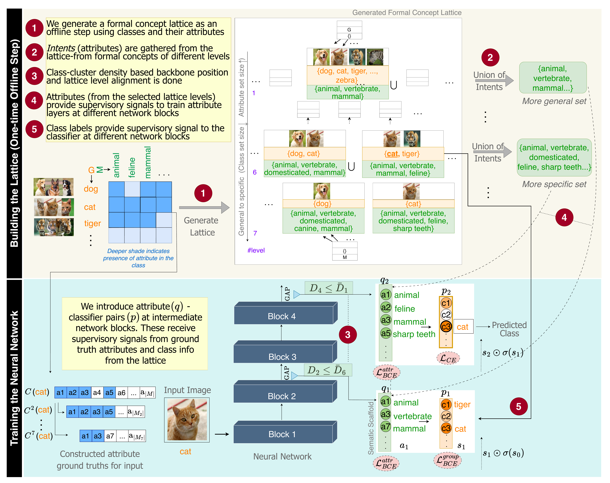

# 🧩 FoCA-CBMs: Formal Concept Analysis for Concept-Based Models

<p align="center">
  <b>Lattices for Concept-Based Learning</b><br>
  <i>ICML 2026</i>
</p>

<p align="center">
  <a href="https://arxiv.org/abs/XXXX.XXXXX"></a>
  <a href="#citation"></a>
</p>

<p align="center">
  
</p>

> **Figure:** A formal concept lattice is constructed from class-attribute associations *(top)*. The lattice's hierarchical levels are aligned with intermediate network blocks using class-cluster density, enabling staged semantic supervision throughout the network's depth *(bottom)*.

---

## 🔍 Overview

Concept-based models (CBMs) learn interpretable predictions by routing classification through human-understandable concepts. However, existing CBMs treat all concepts as a flat set learned at a single network layer, ignoring the hierarchical nature of both human semantic understanding and neural network representations.

**FoCA-CBMs** leverage *Formal Concept Analysis* (FCA) to construct principled semantic lattices from class-attribute relationships. These lattices identify natural supervision points in the network — general concepts (shared by many classes) supervise early layers, while specific concepts (shared by few) supervise deeper layers. This creates a *semantic scaffold* over the network's visual feature hierarchy, enabling:

- 🏗️ Hierarchically structured concept representations across network depth
- 📊 More semantically meaningful intermediate embeddings (lower cluster impurity and compactness scores)
- 🔧 Effective multi-level concept interventions
- 🎯 Competitive or superior classification accuracy

---

## ⚙️ Installation

```bash
# Clone the repository
git clone https://github.com/deepikavemuri/FoCA-CBMs.git
cd FoCA-CBMs

# Create conda environment
conda env create -f fca4nn/environment.yml
conda activate fca4nn
```

**Key dependencies:** Python 3.11, PyTorch 2.6, torchvision 0.21, timm 1.0.15, concepts 0.9.2, scikit-learn 1.6.1

---

## 📁 Repository Structure

```
FoCA-CBMs/
├── fca4nn/                          # 🧠 Main codebase
│   ├── main.py                      # Entry point for training FoCA CBMs
│   ├── model.py                     # FoCA_CBM_resnet, FoCA_CBM_vit, CBM_resnet models
│   ├── train_foca.py                # Training loop for FoCA CBMs
│   ├── train_foca-n.py              # Training loop for FoCA CBM-N (naive variant)
│   ├── train_cbm.py                 # Training loop for vanilla/MLP CBMs
│   ├── losses.py                    # Loss functions (BCE, focal, hierarchical CE, dice)
│   ├── dataloader.py                # Dataset classes for all benchmarks
│   ├── utils.py                     # Training utilities
│   ├── metric_calculator.py         # CI/DBI metric evaluation script
│   ├── lattice_generation/
│   │   └── generate_lattice.py      # Construct formal concept lattice from annotations
│   ├── processing/                  # Lattice parsing and level extraction utilities
│   ├── metric/                      # Cluster purity and separation metrics
│   ├── analysis/
│   │   └── interventions.ipynb      # Concept intervention experiments
│   └── scripts/                     # Shell scripts to reproduce all experiments
│       ├── foca/                    # FoCA CBM training scripts (ResNet)
│       ├── foca/vit/               # FoCA CBM training scripts (ViT)
│       ├── cbm/                    # Vanilla/MLP CBM training scripts
│       └── metric/                 # Metric evaluation scripts
├── DATA/                            # 📂 Pre-computed data artifacts
│   ├── concepts/                    # Concept annotations (JSON + binary matrices)
│   ├── lattices/                    # Pre-computed formal concept lattices (.pkl)
│   └── classes/                     # Class lists per dataset
└── baselines/                       # 🔬 Baseline implementations
    ├── LaBo/
    ├── Coarse-To-Fine-CBMs/
    ├── post-hoc-cbm/
    ├── HybridCBM/
    ├── cem/
    ├── SCBM/
    └── Label-free-CBM/
```

---

## 📦 Data Preparation

### Datasets

Download the following datasets and place them in your preferred data directory:

| Dataset         | Source                                                       | Classes | Attributes |
| --------------- | ------------------------------------------------------------ | :-----: | :--------: |
| **ImageNet100** | [ILSVRC 2012](https://www.image-net.org/) (100-class subset) |   100   |    ~700    |
| **AwA2**        | [Animals with Attributes 2](https://cvml.ista.ac.at/AwA2/)   |   50    |     85     |
| **CIFAR100**    | [CIFAR-100](https://www.cs.toronto.edu/~kriz/cifar.html)     |   100   |    ~700    |

### 🔗 Concept Annotations & Lattices

Pre-computed concept annotations and formal concept lattices are provided in `DATA/`:
- `DATA/concepts/` — Class-level attribute annotations as JSON files and binary concept matrices (`.npy`)
- `DATA/lattices/` — Pre-built formal concept lattices (`.pkl`) for each dataset

To **generate a lattice**:
```bash
cd fca4nn
python lattice_generation/generate_lattice.py DATA/concepts/<dataset>_concepts.json \
    -o DATA/lattices/<dataset>_context.pkl -v
```

---

## 🚀 Training FoCA CBMs

### Quick Start

```bash
cd fca4nn

# Train FoCA CBM on CIFAR100 (ResNet-50)
CUDA_VISIBLE_DEVICES=0 python main.py \
    --do_train_full \
    --do_test \
    --seed 42 \
    --dataset cifar100 \
    --model resnet50 \
    --concept_wts 0.01 \
    --cls_wts 0.01 \
    --data_root ./DATA/cifar100/ \
    --concept_file ./DATA/concepts/cifar100_concepts.json \
    --lattice_path ./DATA/lattices/cifar100_context.pkl \
    --num_clfs 2 \
    --lattice_levels 1 2 \
    --backbone_layer_ids 3 4 \
    --lr 3e-4 \
    --epochs 75 \
    --batch_size 128 \
    --clf_special_init \
    --save_model_dir ./saved_models/
```

### 🔁 Reproducing All Experiments

Scripts for all datasets and configurations are provided in `fca4nn/scripts/`:

```bash
cd fca4nn

# 🏔️ ResNet-based FoCA CBMs
bash scripts/foca/cifar100.sh      # CIFAR100
bash scripts/foca/inet100.sh       # ImageNet100
bash scripts/foca/awa2.sh          # AwA2

# 🤖 ViT-based FoCA CBMs
bash scripts/foca/vit/cifar100.sh  # CIFAR100 (DeiT-Base)
bash scripts/foca/vit/inet100.sh   # ImageNet100 (DeiT-Base)
bash scripts/foca/vit/awa2.sh      # AwA2 (DeiT-Base)

# 📏 Vanilla CBM baselines
bash scripts/cbm/cbm_cifar100.sh
bash scripts/cbm/cbm_inet100.sh
bash scripts/cbm/cbm_awa2.sh
```

> ⚠️ **Note:** Update `data_root`, `concept_file`, and `lattice_path` in the scripts to match your local paths.

### 🎛️ Key Training Arguments

| Argument               | Description                                                 | Default    |
| ---------------------- | ----------------------------------------------------------- | ---------- |
| `--model`              | Backbone architecture (`resnet18`, `resnet50`, `resnet101`) | `resnet18` |
| `--model_type`         | Architecture family (`resnet`, `vit`)                       | `resnet`   |
| `--num_clfs`           | Number of intermediate semantic layers                      | 1          |
| `--lattice_levels`     | Which lattice levels to use for supervision                 | —          |
| `--backbone_layer_ids` | Which backbone blocks to attach semantic layers to          | —          |
| `--concept_wts`        | Weight for attribute prediction loss (α)                    | 0.1        |
| `--cls_wts`            | Weight for intermediate classifier loss (β)                 | 0.01       |
| `--clf_special_init`   | Initialize classifiers using lattice structure              | `False`    |
| `--exclusive_attrs`    | Use cumulative attribute sets across levels                 | `False`    |

---

## 📐 Evaluation

### 📊 Cluster Impurity (CI) & Compactness (DBI) Metrics

Evaluate the semantic quality of learned intermediate representations:

```bash
cd fca4nn

CUDA_VISIBLE_DEVICES=0 python metric_calculator.py \
    --dataset cifar100 \
    --model_name OURS-2FCA::resnet50 \
    --model_weights <path_to_trained_model.pt> \
    --data_path ./DATA/cifar100/ \
    --lattice_path ./DATA/lattices/cifar100_context.pkl \
    --lattice_levels 1 2 \
    --backbone_layer_ids 3 4 \
    --metadata_path ./saved_models/metric_metadata/ \
    --separation_score davies_bouldin \
    --clustering_method kmeans
```

Supported model identifiers for `--model_name`:
- **🟡 Ours:** `OURS-1FCA::resnet50`, `OURS-2FCA::resnet50`, `OURS-1FCA::vit_base_patch16_224`, `MCLCBM::resnet50`
- **⚪ Baselines:** `CBM::resnet50`, `CEM::resnet50`, `SCBM::resnet50`, `PCBM::resnet50`, `MLPCBM::resnet50`, `PYTORCH::resnet50`, `CLIP::RN50`, `VIT::deit_base_patch16_224`

### 🖼️ Qualitative Results: Cluster Visualizations

<p align="center">
  
</p>

> **Figure:** Qualitative visualization of clusters formed at intermediate network blocks. FoCA CBMs produce more semantically coherent clusters with lower impurity and better compactness compared to baselines.


---

## 🔬 Baselines

We include implementations of several baselines adapted for our experimental setup. Each baseline folder contains its own `run.sh` and `README.md`:

| Baseline       | Reference                |    Venue     |                          README                           |
| -------------- | ------------------------ | :----------: | :-------------------------------------------------------: |
| Post-hoc CBM   | Yuksekgonul et al.       |  ICLR 2023   |    [→ Instructions](baselines/post-hoc-cbm/README.md)     |
| Label-free CBM | Oikarinen et al.         |  ICLR 2023   |   [→ Instructions](baselines/Label-free-CBM/README.md)    |
| CEM            | Espinosa Zarlenga et al. | NeurIPS 2022 |         [→ Instructions](baselines/cem/README.md)         |
| LaBo           | Yang et al.              |  CVPR 2023   |        [→ Instructions](baselines/LaBo/README.md)         |
| SCBM           | Vandenhirtz et al.       | NeurIPS 2024 |        [→ Instructions](baselines/SCBM/README.md)         |
| CF-CBM         | Panousis et al.          | NeurIPS 2024 | [→ Instructions](baselines/Coarse-To-Fine-CBMs/README.md) |
| HybridCBM      | Liu et al.               |  CVPR 2025   |      [→ Instructions](baselines/HybridCBM/README.md)      |

---

## 📝 Citation

If you find this work useful, please cite:

```bibtex
@inproceedings{focacbms2026,
  title={Lattices for Concept-Based Learning},
  author={Vemuri, Deepika SN and Adhikari, Sayanta and Saha, Ankit and Kher, Krishn Vishwas and Balasubramanian, Vineeth N},
  booktitle={International Conference on Machine Learning (ICML)},
  year={2026}
}
```

---

<p align="center">
  ⭐ If you find this repository helpful, please consider giving it a star!
</p>
