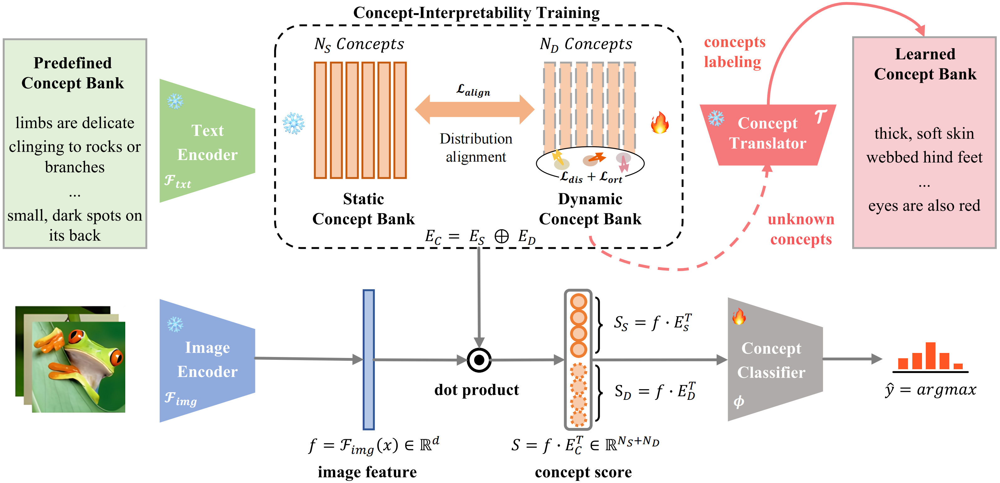

# HybridCBM

Code for the paper "Hybrid Concept Bottleneck Models"


## Environments

We run our experiments using Python 3.11. You can install the required packages using:

```
conda create --name hybridcbm python=3.11
conda activate hybridcbm
pip install -r requirements.txt
```
Since we use [cuML](https://github.com/rapidsai/cuml) for linear probe, you need to install the cuML package. You can install it using:
```
pip install \
    --extra-index-url=https://pypi.nvidia.com \
    "cudf-cu12==24.10.*" "dask-cudf-cu12==24.10.*" "cuml-cu12==24.10.*" \
    "cugraph-cu12==24.10.*" "nx-cugraph-cu12==24.10.*" "cuspatial-cu12==24.10.*" \
    "cuproj-cu12==24.10.*" "cuxfilter-cu12==24.10.*" "cucim-cu12==24.10.*" \
    "pylibraft-cu12==24.10.*" "raft-dask-cu12==24.10.*" "cuvs-cu12==24.10.*" \
    "nx-cugraph-cu12==24.10.*"
```
+ [RAPIDS Installation Guide](https://docs.rapids.ai/install/)

## Datasets
The file structure of each dataset folder is:

```
dataset/
|-- images/
|-- concepts/
|-- splits/
```
**Note**:
You need to put all images each dataset in `images/`. In `concepts/`, there is a csv file `concepts.csv` is the candidate concepts. `splits/` stores the train/val/test splits in csv format. 
You need to download them and store in the corresponding folder: `datasets/{dataset name}/images/`.

Here is the downloading links for each dataset:
| **Category**       | **Dataset**       | **Description**         | **Download Link**                                                                 |
|---------------------|-------------------|-------------------------|-----------------------------------------------------------------------------------|
| **Translator datasets** | MSCOCO          | Train captions          | [captions](https://drive.google.com/file/d/1D3EzUK1d1lNhD2hAvRiKPThidiVbP2K_/view?usp=sharing) |
|                     |                   | Train images            | [images](http://images.cocodataset.org/zips/train2014.zip)                        |
|                     |                   | Val images              | [images](http://images.cocodataset.org/zips/val2014.zip)                          |
|                     | ConceptNet        | ConceptNet 5.7          | [ConceptNet 5.7](https://github.com/commonsense/conceptnet5/wiki/Downloads)       |
| **CBM datasets**    | Aircraft          | Aircraft dataset        | [click to download](https://www.robots.ox.ac.uk/~vgg/data/fgvc-aircraft/archives/fgvc-aircraft-2013b.tar.gz) |
|                     | CIFAR-10          | CIFAR-10 dataset        | [click to download](https://www.cs.toronto.edu/~kriz/cifar-10-python.tar.gz)      |
|                     | CIFAR-100         | CIFAR-100 dataset       | [click to download](https://www.cs.toronto.edu/~kriz/cifar-100-python.tar.gz)     |
|                     | CUB               | CUB dataset             | [click to download](https://data.caltech.edu/records/20098)                       |
|                     | DTD               | DTD dataset             | [click to download](https://www.robots.ox.ac.uk/~vgg/data/dtd/download/dtd-r1.0.1.tar.gz) |
|                     | Flower            | Flower dataset          | [click to download](https://www.robots.ox.ac.uk/~vgg/data/flowers/102/102flowers.tgz) |
|                     | Food              | Food dataset            | [click to download](http://data.vision.ee.ethz.ch/cvl/food-101.tar.gz)            |
|                     | HAM10000          | HAM10000 dataset        | [click to download](https://dataverse.harvard.edu/dataset.xhtml?persistentId=doi:10.7910/DVN/DBW86T#) |
|                     | ImageNet          | ImageNet dataset        | [click to download](https://image-net.org/index.php)                              |
|                     | RESISC45          | RESISC45 dataset        | [click to download](https://1drv.ms/u/s!AmgKYzARBl5ca3HNaHIlzp_IXjs)              |
|                     | UCF101            | UCF101 dataset          | [click to download](https://drive.google.com/file/d/10Jqome3vtUA2keJkNanAiFpgbyC9Hc2O/view?usp=sharing) |

## Directories

* `config/` is the config files for all experiments, including linear probe (`config/LProbe`) and HybridCBM (`config/HybridCBM`). You can modify the config files to change the system arguments.
* `exp/` is the work directories of the experiments. The config files and model checkpoints will be saved in this folder.
* `models/` is the models:
    * Linear Probe: `models/linearProb.py`
    * HybridCBM: `models/cbm/linearCBM.py`
    * concept selection functions: `models/conceptBank/concept_select.py`
* Other files:
    * `datasets/preprocess.py` is the preprocess file for the datasets.
    * `datasets/dataloader.py` is the dataloaders for Hybrid and Linear Probe, respectively.
    * `trainLinear.py` is the interface to run all experiments.
    * `train_translator.sh` is the bash file to train the translator. And will save the model in `weights/translator`.

## Linear Probe
For example, for CUB dataset 1-shot with ViT-L/14 image encoder, the command is:

``` python
python train_probe.py --config config/LProbe/CUB.py --cfg-options dataset=CUB --cfg-options n_shots=1 --cfg-options clip_model=ViT-L/14 --cfg-options exp_root=exp/LProbe/CUB/ViT-L_14
```

The code will automatically encode the images and run a hyperparameter search on the L2 regularization using the dev set. The best validation and test performance will be saved in the `exp/LProbe/CUB/ViT-L_14/train_1shot.log`.
## Translator Training
To train the translator, run the following command:
```
bash train_translator.sh
```
you may need to modify the `train_translator.sh` to set the `dataset` and `clip model` you want to train. The model will be saved in `weights/translator`.
The set the path of the model in the `config/HybridCBM/base.py` file. For example, if you train the translator with `ViT-L/14` model, you need to set the `translator_path` in the `config/HybridCBM/base.py` file as:
``` python
translator_path = weights/translator/{clip_model.replace("/", "_")}-AUG_True/translator.pt'
```
We provide the pretrained ViT-L/14 translator models checkpoints in this [link](https://drive.google.com/drive/folders/1XIVW7pqvSaS3OBF6s_j4a_XwucGNAXcY?usp=sharing).
## Hybrid Training

To train the LaBo, run the following command:

``` python
python trainLinear.py --config config/HybridCBM/CUB/CUB_allshot.py 
--cfg-options clip_model=ViT-L/14 
--cfg-options concept_select_fn=submodular 
--cfg-options num_concept_per_class=10 
--cfg-options dynamic_concept_ratio=0.5 
--cfg-options lambda_discri_alpha=2 
--cfg-options lambda_discri_beta=0.1 
--cfg-options lambda_ort=0.1 
--cfg-options lambda_align=0.01
```
After reaching the maximum epochs, the checkpoint with the highest validation accuracy and the corresponding config file will be saved to `exp/HybridCBM/{DATASET}_Zero_L1`.

## Hybrid Testing
To test the HybridCBM, run the following command:
``` python
python trainLinear.py --exp_root <exp dir path> --test
```
For example, to test the HybridCBM on the CUB dataset, run the following command:
``` python
python trainLinear.py --exp_root exp/HybridCBM/CUB_Zero_L1 --test
```

## Acknowledgments
This repository is heavily based on the following repositories:
[CLIP](https://github.com/openai/CLIP).
[ClipCap](https://github.com/rmokady/CLIP_prefix_caption), [DeCap](https://github.com/dhg-wei/DeCap?tab=readme-ov-file).
[Labo](https://github.com/YueYANG1996/LaBo/tree/main).